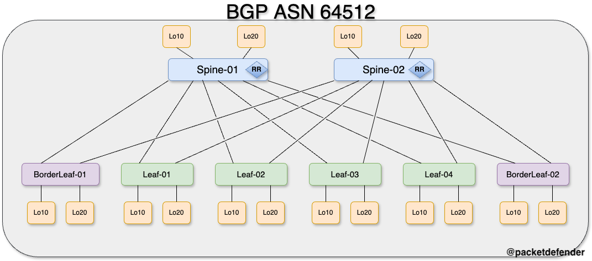

# BGP

> [!IMPORTANT]  
> If there is no hard requirement below, you can configure it how you wish

Below are the requirements for setting up BGP. 
- How we will build the overlay is with BGP
    - ASN - 64512
    - Peer with loopback20 addresses (10.10.10.x)
    - Spine switches are going to be route reflectors
    - Use Peer Groups on the Spine switches to make the configuration clean
    - Authenticate peers with password **P@55w0rd**

> [!TIP]
> - There is a default username and password set to: 
>   - Username: admin
>   - Password: P@55w0rd!
> - If you do modify the password, you must remember to change it if you do not follow along and upload new configurations to the device.
> - This lab is built on Nexus9300v's running 9.3.4. If you use any other image, the configuration might be different or not work at all.
## Logical Topology

Below is the logical topology of the BGP portion of the lab.

