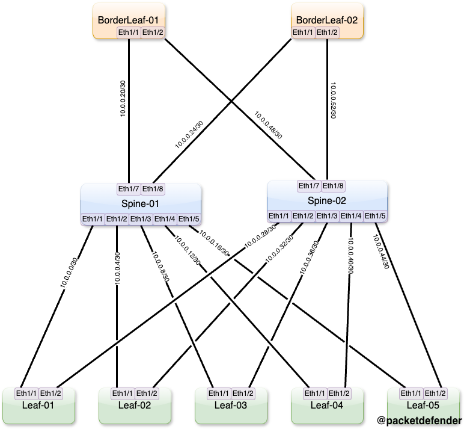

# Default Configuration

This is where the default configurations are for the devices. There are a few things to note:

- There is a default username and password set, you can change it if you would like to here
  - Username: admin
  - Password: P@55w0rd!
- If you do modify the password, you must remember to change it if you do not follow along and upload new configurations to the device.
- This lab is built on Nexus9300v's running 9.3.4. If you use any other image, the configuration might be different or not work at all.

## Physical Topology

Below is the physical topology of the lab.

