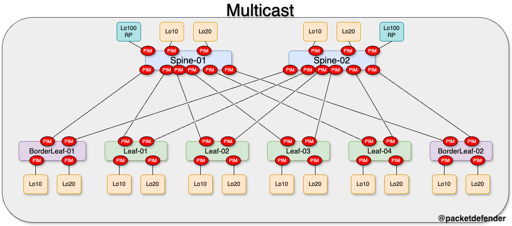

# Multicast

> [!IMPORTANT]  
> If there is no hard requirement below, you can configure it how you wish

Below are the requirements for setting up Multicast.

## Configuration Requirements

- Configure Spine devices as Rendezvous points
  - Using ip address 100.100.100.100 assigned to a new loopback interface
  - Add this new interface to the UNDERLAY OSPF process
- Configure PIM Sparse-Mode on all interfaces
- Configure a group list on the Rendezvous point configuration on the leafs

> [!TIP]
>
> - There is a default username and password set to:
>   - Username: admin
>   - Password: P@55w0rd!
> - If you do modify the password, you must remember to change it if you do not follow along and upload new configurations to the device.
> - This lab is built on Nexus9300v's running 9.3.4. If you use any other image, the configuration might be different or not work at all.

## Logical Topology

Below is the logical topology of the Multicast portion of the lab.

