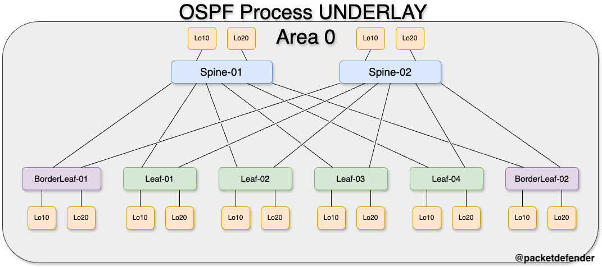

# OSPF

> [!IMPORTANT]  
> If there is no hard requirement below, you can configure it how you wish

Below are the requirements for setting up OSPF. 
- Underlay IGP is OSPF, the following must be configured:
    - Process - UNDERLAY
    - All addressed interfaces on the device should added to the routing protocol
        - All links must be configured as point to point links
        - All links must have authentication enabled with the following parameters
            - Use Message Digest
                - Password: *P@55w0rd*

> [!TIP]
> - There is a default username and password set to: 
>   - Username: admin
>   - Password: P@55w0rd!
> - If you do modify the password, you must remember to change it if you do not follow along and upload new configurations to the device.
> - This lab is built on Nexus9300v's running 9.3.4. If you use any other image, the configuration might be different or not work at all.

## Logical Topology

Below is the logical topology of the OSPF portion of the lab.

