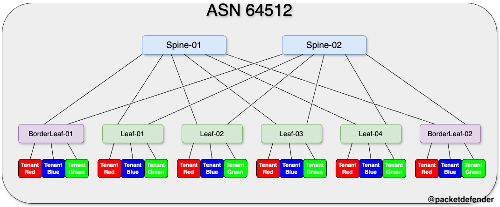

# VXLAN and EVPN

> [!IMPORTANT]  
> If there is no hard requirement below, you can configure it how you wish

Below are the requirements for setting up VXLAN and EVPN. 
## VXLAN Network:

|    Tenant    | VLAN | L3VNI VLAN | L2 VNI | L3 VNI |   IP Address   | Multicast Group |
|:------------:|:----:|:----------:|:------:|:------:|:--------------:|:---------------:|
|  Tenant_Red  |  100 |     200    |  21000 |  32000 | 172.16.24.0/24 |   225.1.0.100   |
|  Tenant_Blue |  150 |     250    |  21500 |  32500 | 172.18.24.0/24 |   225.1.0.150   |
| Tenant_Green |  350 |     450    |  23500 |  34500 | 172.16.26.0/24 |   225.1.1.150   |

## VRF
- Configure VRFs for each tenant
- Set VNI to L3 VNI
- Set RD to Auto
- Under address family ipv4 unicast
  - Set route-targets to auto for ipv4 and evpn

## VLAN:
- Configure VLANS with appropriate vn-segments
  - VLAN 100 VXLAN21000
  - VLAN 200 VXLAN32000
  - VLAN 150 VXLAN21500
  - VLAN 250 VXLAN32500
  - VLAN 350 VXLAN23500
  - VLAN 450 VXLAN34500

## Layer 2 VNI Interface VLANs
- Add to appropriate VRF
- Configure fabric forwarding anycast gateway with MAC 0000.dead.beef

## Layer 3 VNI Interface VLANs
- Configure L3 VXLAN interfaces
  - Assign appropriate VRF to VLAN
  - Configure IP forward

## Network Virtualization Edge (NVE) Interface:
- Configure BGP as the host reachability protocol
- Source interface should be loopback 1
- Create L2 member VNIs
  - Suppress ARP
  - Configure multicast groups for each tenant
- Configure L3 member VNIs

> [!TIP]
> - There is a default username and password set to: 
>   - Username: admin
>   - Password: P@55w0rd!
> - If you do modify the password, you must remember to change it if you do not follow along and upload new configurations to the device.
> - This lab is built on Nexus9300v's running 9.3.4. If you use any other image, the configuration might be different or not work at all.

## Logical Topology

Below is the logical topology of the VXLAN / EVPN portion of the lab..

